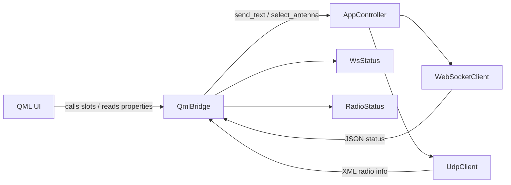
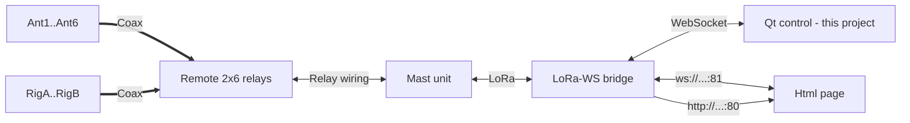

# Remote Switch (Qt)

## Build

Use the build scripts in the scripts folder. They create version.txt so the app can show a git-based version string.

If you run PyInstaller manually, create version.txt in the project root (short git hash) or set APP_GIT_COMMIT before building.

## Architecture



### Main classes

- `AppController` in [src/core/app_controller.py](src/core/app_controller.py) owns the WebSocket and UDP clients, wires callbacks, and exposes `start()`, `stop()`, and `send_text()`.
- `QmlBridge` in [src/ui/qml_bridge.py](src/ui/qml_bridge.py) is the main UI bridge, exposing properties, signals, and slots used by QML.
- `WebSocketClient` in [src/net/websocket_client.py](src/net/websocket_client.py) manages the WebSocket connection and event hooks.
- `UdpClient` in [src/net/udp_client.py](src/net/udp_client.py) listens for UDP radio info frames.
- `WsStatus` in [src/ui/ws_status.py](src/ui/ws_status.py) stores device state parsed from WebSocket JSON.
- `RadioStatus` in [src/ui/radio_status.py](src/ui/radio_status.py) stores rig frequency info parsed from UDP XML.
- `AppState` in [src/core/state.py](src/core/state.py) keeps basic runtime state shared by the controller.

### Busy flag handling

- `QmlBridge.busy` is set to true before sending a command and reset on WebSocket response or error paths.
- The flag is cleared in `_handle_ws_message`, `_handle_ws_error`, `_handle_ws_disconnected`, and `_handle_ws_send_failed` in [src/ui/qml_bridge.py](src/ui/qml_bridge.py).
- QML uses `bridge.busy` to disable antenna buttons and avoid overlapping commands (see [src/ui/qml/Main.qml](src/ui/qml/Main.qml)).

## Config

The app reads settings from [config.json](config.json).

- `app.theme`: UI theme name (for QML this is currently informational).
- `app.ui`: UI backend selector; `qml` is the supported value.
- `wsConnection.url`: Base URL or host for the WebSocket/HTTP bridge.
- `wsConnection.port`: WebSocket port (default firmware uses 81).
- `udpConnection.host`: Host to bind/connect for UDP radio info.
- `udpConnection.port`: UDP port for XML radio info frames.
- `rigs.rigAName`: Display name for Rig A.
- `rigs.rigBName`: Display name for Rig B.
- `antennas.ant0Name`: Display name for antenna 0 (OFF).
- `antennas.ant1Name`..`antennas.ant6Name`: Display names for antennas 1-6.
- `autoSwitch.antennaRules`: List of auto-switch rules (per rig and frequency range).
- `autoSwitch.antennaRules[].rig`: Target rig, `A` or `B`.
- `autoSwitch.antennaRules[].minFrequency`: Minimum frequency for the rule (kHz).
- `autoSwitch.antennaRules[].maxFrequency`: Maximum frequency for the rule (kHz).
- `autoSwitch.antennaRules[].primaryAntenna`: Antenna index to select first.
- `autoSwitch.antennaRules[].secondaryAntenna`: Fallback antenna index if primary is reseved by other rig.
- `logging.level`: Log level (e.g., `DEBUG`, `INFO`, `WARNING`).
- `logging.console`: Enable console logging output.
- `logging.file`: Log file path.

Example config:

```json
{
	"app": {
		"theme": "dark",
		"ui": "qml"
	},
	"wsConnection": {
		"url": "http://192.168.68.128/",
		"port": 81
	},
	"udpConnection": {
		"host": "127.0.0.1",
		"port": 12060
	},
	"rigs": {
		"rigAName": "K3",
		"rigBName": "IC706"
	},
	"antennas": {
		"ant0Name": "OFF",
		"ant1Name": "OCF",
		"ant2Name": "R8",
		"ant3Name": "3",
		"ant4Name": "4",
		"ant5Name": "5",
		"ant6Name": "DL"
	},
	"autoSwitch": {
		"antennaRules": [
			{
				"rig": "A",
				"minFrequency": 100,
				"maxFrequency": 8000,
				"primaryAntenna": 1,
				"secondaryAntenna": 4
			},
			{
				"rig": "A",
				"minFrequency": 8000,
				"maxFrequency": 60000,
				"primaryAntenna": 4,
				"secondaryAntenna": 1
			},
			{
				"rig": "B",
				"minFrequency": 100,
				"maxFrequency": 8000,
				"primaryAntenna": 1,
				"secondaryAntenna": 4
			},
			{
				"rig": "B",
				"minFrequency": 8000,
				"maxFrequency": 60000,
				"primaryAntenna": 4,
				"secondaryAntenna": 1
			}
		]
	},
	"logging": {
		"level": "DEBUG",
		"console": true,
		"file": "logs/app.log"
	}
}
```

## Big Picture


- **Ant1..Ant6:** Six possible antennas (connected to relay unit).
- **RigA..RigB:** Two rigs (connected to relay unit).
- **Remote 2x6 relays:** Remote 2x6 antenna switch.
- **Mast unit:** Wisblock RAK11300 controller with galvanically isolated wiring through an I2C IO expander (MCP27016) to the relay unit; firmware is LoRaWan-Arduino.
- **LoRa-WS bridge:** Heltec V2 module with LoRa and WiFi radios; firmware uses RadioLib for LoRa, WebSocketsServer for the WS endpoint on port 81, and WebServer for the HTTP control page on port 80.
- **Qt control - this project:** Qt interface for selecting antennas; connects to the bridge over WebSocket on port 81.
